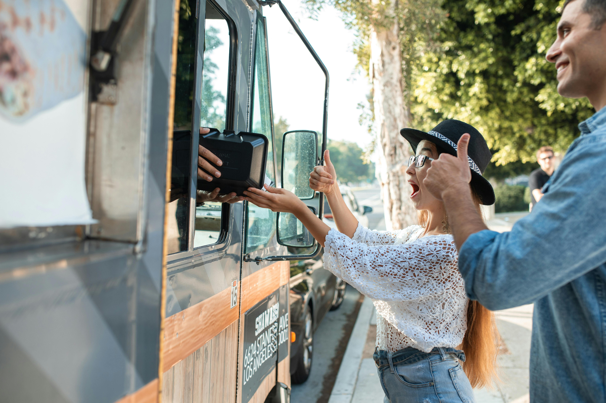
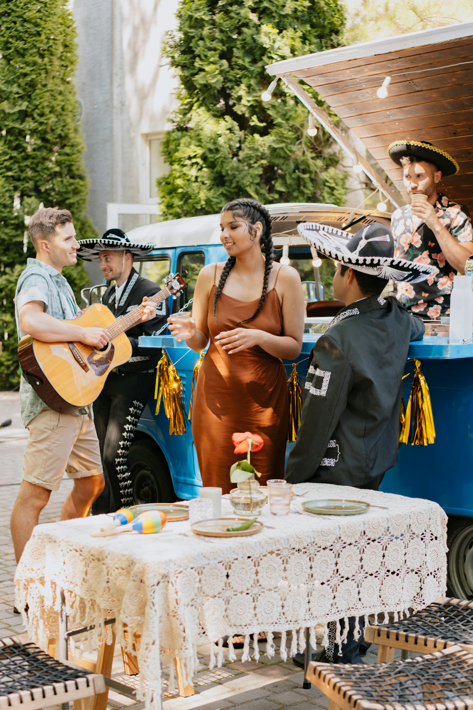

Food 4 the People       

Collective Food Sovereignty
===========================

Yummy connections
-----------------

### We are a community food truck

#### Hungry? Come eat!

##### Share a meal, pass one on!

###### jaden smith's free _restaurant_ is a great example of an already established free food community program!

[**Have a meal, share a meal**](https://www.goodgoodgood.co/articles/jaden-smith-free-restaurant-for-homeless)

### Lists [Go](lists.html) to lists page [Footer](#footer)

Serving our community 

#### What we stand for: Community connection and support

*   Healthy food as an inherent right
*   Community connection as an inherent right
*   Bridging gaps for the underserved
*   Working collectively towards equitiable communities
*   Generating more capacity

Love, community connections, support
------------------------------------

![two customers outside food truck smiling. 
A brown skinned, black, masc-presenting person with brown, curly, medium length hair holds up their phone in one hand; to take a selfie of both of them, and their food in the other. The individual is wearing a white mid-length sleeved shirt, with a black fabric vest over top. Beside them, is a white fem-presenting person; with medium long-blonde hair, a red sleeveless top underneath white overalls; holding their food in their hands, with their arm around the other person, smiling for the photo.](images/happy-selfie.jpg)

1.  Our food truck is special
2.  Order your food
3.  Drinks
4.  Stay for conversation
5.  Mutual aid
6.  Share pictures to spread awareness (if you're comfortable)

###### Come visit, build community, connections and care with us!

[Strathcona Gardens Community Page](https://www.strathconagardens.ca)

Website made by Burb
